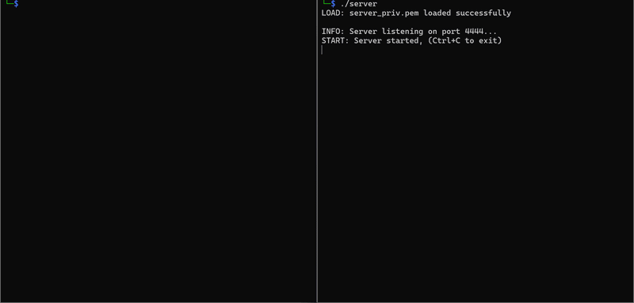

# 🔐 DSS — Digital Signature Server

A secure client-server application for **digital signature** operations, built with C++ and OpenSSL as a university project for the *Foundations of Cybersecurity* course (2024/25).

The system implements a custom cryptographic protocol with **Perfect Forward Secrecy**, **mutual authentication**, and an encrypted channel for key management and document signing/verification.

---

## 🎬 Demo



---

## 📁 Project Structure

```
Project_FoC/
├── Makefile                # Build automation
├── server_priv.pem         # Server RSA private key (signing)
├── server_pub.pem          # Server RSA public key (verification)
└── src/
    ├── common/
    │   ├── types.h             # Shared types, constants and macros
    │   ├── utility.h           # Cryptographic utility functions (header)
    │   └── utility.cpp         # DH, AES-CBC, HMAC, key derivation, secure I/O
    ├── server/
    │   ├── server.cpp          # Server main, connection handling, command dispatch
    │   ├── protocol_server.h   # Server-side handshake protocol (header)
    │   ├── protocol_server.cpp # Server-side handshake implementation
    │   ├── userdb.h            # User database management (header)
    │   └── userdb.cpp          # User CRUD, password hashing, key storage
    └── client/
        ├── client.cpp          # Client main, CLI interface, command loop
        ├── protocol_client.h   # Client-side handshake protocol (header)
        └── protocol_client.cpp # Client-side handshake implementation
```

---

## 🔒 Security Protocol

### Handshake (Key Exchange + Server Authentication)

```
Client                                          Server
  │                                                │
  │──── c_pub_key (DH) ──────────────────────────►│
  │                                                │  generates DH pair
  │                                                │  shared_secret = DH(s_priv, c_pub)
  │                                                │  deriveKeys → c_key, s_key, c_mac, s_mac
  │                                                │  signature = sign(server_priv.pem, c_pub||s_pub)
  │                                                │  encrypted_sig = AES-CBC(s_key, iv, signature)
  │                                                │  hmac = HMAC(s_mac, iv||nonce||s_pub||enc_sig)
  │◄──── iv || nonce || s_pub || enc_sig || hmac ──│
  │                                                │
  │  shared_secret = DH(c_priv, s_pub)             │
  │  deriveKeys → c_key, s_key, c_mac, s_mac       │
  │  verify HMAC, decrypt sig, verify with pub.pem  │
  │                                                │
  │──── {username + password} encrypted ──────────►│  authenticate user
  │◄──── {ACK/CHG/ERR} encrypted ─────────────────│
  │                                                │
  ╰── Secure channel established (sendSecure/recvSecure) ──╯
```

### Security Properties

| Property | Implementation |
|---|---|
| **Perfect Forward Secrecy** | Ephemeral Diffie-Hellman (FFDHE2048) per session |
| **Confidentiality** | AES-256-CBC with random IV per message |
| **Integrity** | HMAC-SHA256 on IV + ciphertext |
| **Replay Protection** | Client/Server nonces refreshed every message |
| **Non-Malleability** | HMAC verified before decryption (Encrypt-then-MAC) |
| **Server Authentication** | RSA digital signature during handshake |
| **Client Authentication** | Username + salted/hashed password over secure channel |
| **Key Separation** | Separate keys per direction: `c_key`/`c_mac` (client→server), `s_key`/`s_mac` (server→client) |

---

## 🛠️ Available Commands

Once authenticated, the client provides an interactive CLI with the following commands:

| Command | Description |
|---------|-------------|
| `CRT` | **Create** a new RSA key pair (stored encrypted on server) |
| `DEL` | **Delete** your key pair from the server (irreversible) |
| `SGN` | **Sign** a local file using your private key (server-side) |
| `VRF` | **Verify** a signed document against a user's public key |
| `GET` | **Retrieve** the public key of any registered user |
| `PBK` | **Print** the last retrieved public key (local cache) |
| `CHG` | **Change** your password |
| `PRT` | Print server debug info *(debug only)* |

---

## ⚙️ Prerequisites

- **OS**: Linux or WSL (Windows Subsystem for Linux)
- **Compiler**: `g++` with C++17 support
- **Library**: OpenSSL (`libssl-dev`)

```bash
sudo apt update
sudo apt install build-essential libssl-dev
```

---

## 🚀 Build & Run

### Compile

```bash
make all
```

This compiles both `bin/server` and `bin/client`.

### Initialize the database (first time only)

```bash
./bin/server reset
```

Creates default users in `users.db`.

### Run

Open **two terminals**:

```bash
# Terminal 1 — Start the server
make run-server
```

```bash
# Terminal 2 — Start the client
make run-client
```

The server listens on `127.0.0.1:4444`. The client connects automatically.

### Other Make targets

```bash
make clean        # Remove bin/ and obj/ directories
make run-server   # Build (if needed) and start the server
make run-client   # Build (if needed) and start the client
```

---

## 📝 Usage Example

```
$ make run-client

LOAD: server_pub.pem loaded successfully
INFO: Connecting to server at 127.0.0.1:4444...

Enter username: alice
Enter password: ********

INFO: handshake finished

INFO: Insert command: CRT
ACK: Creation of keys successful

INFO: Insert command: SGN
SIGN: Enter the file name to sign: document.pdf
ACK: File signed successfully
SIGN: Signature saved to document.pdf.sig

INFO: Insert command: VRF
VERIFY: Enter the file name to verify: document.pdf
VERIFY: Enter the signature file name: document.pdf.sig
VERIFY: Enter the username who signed the document: alice
VERIFY: Document verification successful
```

---

## 🏗️ Technical Details

- **Key Exchange**: Finite Field Diffie-Hellman (FFDHE2048, RFC 7919)
- **Symmetric Encryption**: AES-256-CBC with PKCS#7 padding
- **MAC**: HMAC-SHA256
- **Key Derivation**: HKDF from DH shared secret + server nonce
- **Digital Signatures**: RSA with SHA-256 (server authentication + document signing)
- **Password Storage**: SHA-256 with per-user random salt
- **Private Key Storage**: User private keys are AES-encrypted with password-derived keys before storage
- **Concurrency**: Multi-threaded server with `std::thread` (one thread per client)

---

## 📄 License

University project — *Foundations of Cybersecurity 2024/25*.
